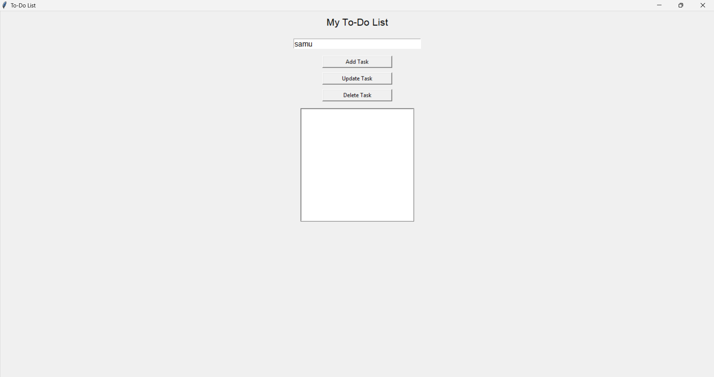

# 📝 To-Do List Application (Python Tkinter)

## 📌 Project Overview

This project is a simple and user-friendly **To-Do List Application** developed using **Python and Tkinter**.
It allows users to manage their daily tasks efficiently through a graphical interface.

The application supports adding, updating, deleting, and viewing tasks, making it a useful tool for task organization and productivity.

---

## 🎯 Features

* ➕ Add new tasks
* 🔄 Update selected tasks
* ❌ Delete tasks
* 📋 Display tasks in a listbox
* ✨ Auto-fill selected task in input field
* ⚠️ Error handling using popup messages
* 🎨 Simple and clean GUI design

---

## 🛠️ Technologies Used

* **Python**
* **Tkinter (Standard GUI Library in Python)**

---

## 🚀 How to Run the Project

### 1️⃣ Clone the Repository

```bash
git clone <your-repo-link>
```

### 2️⃣ Open Project Folder

```bash
cd todolist
```

### 3️⃣ Run the Application

```bash
python todolist.py
```

---

## 💻 Project Structure

```
todolist/
│── todolist.py
│── README.md
```

---

## 📸 Screenshot


---

## 🔍 How the Application Works

1. Enter a task in the input field
2. Click **Add Task** to save it
3. Tasks will appear in the list below
4. Select a task → it auto-fills in the input field
5. Click **Update Task** to modify it
6. Click **Delete Task** to remove it

---

## ⚙️ Code Explanation

### 🔹 Task Storage

Tasks are stored in a simple Python list:

```python
tasks = []
```

### 🔹 Add Task

* Takes input from user
* Validates empty input
* Adds task to list

### 🔹 Update Task

* Checks if a task is selected
* Updates selected task with new value

### 🔹 Delete Task

* Removes selected task from list

### 🔹 Auto-fill Feature

* When user selects a task, it appears in the input box
* Makes updating easier and faster

---

## ⚡ Future Enhancements

* 💾 Save tasks permanently (file/database)
* 🎨 Add modern UI (Dark Mode / Styling)
* ✔️ Mark tasks as completed
* ⏰ Add deadlines and reminders
* 🌐 Convert into web application

---

## 🙌 Acknowledgement

This project was developed as part of learning **Python GUI development using Tkinter** and improving programming skills.

---

## 📬 Contact

For suggestions or improvements, feel free to reach out.

---
